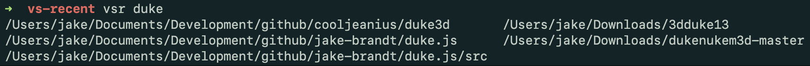
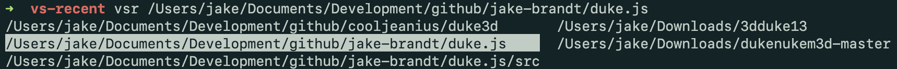

# VS-Recent for ZSH
By Jake Brandt (https://github.com/jake-brandt)

## A ZSH wrapper with autocomplete to `cd` into your recent VS Code directories

VS-Recent or `vsr`, is a wrapper around your system's `cd` command
that takes advantage of ZSH's autocomplete integration support to 
list out VS Code's recently-opened paths:





## Installation

1. Clone this repo to a local, **permanent** location on your computer:

    ```sh
    git clone git@github.com:jake-brandt/vs-recent.git
    ```

2. After cloning, open a terminal and navigate to the project directory.

3. Run the installation script **from within the directory**:

    ```sh
    source ./install.sh
    ```

    This script will register the directory as part of your `fpath`
    environment variable collection of autocomplete functions, create
    a symlink to `vsr.sh` in `/usr/local/bin/vsr` and alias `vsr` to
    `. vsr` to allow the script to run in the current shell context.

4. Upon successful installation, follow the on-screen instructions to
   restart your shell or `source ~/.zshrc` to activate VSR.

## Usage

Typing `vsr` followed by a SPACE and TAB will trigger VSR's
autocomplete, listing all recent **directories** opened by VS Code
under your user. Before hitting TAB, typing part of a known recent
directory will limit the autocomplete list to only those paths
containing the provided text.

Under either scenario, hitting TAB a second time will allow arrow key
navigation of the list (as is standard with ZSH autocomplete).

## Tips

* VSR uses the system's `cd` command under the hood. Therefore, if
you want to return to your previous directory, you can type `cd -` as
is standard in most UNIX/Linux distributions.

## Known issues

* VSR currently only supports macOS. This is not permament and support
for other systems (Linux, Unix, WSL, Git Bash on Windows) will be
added.

* VSR currently expects your VS Code user files to be stored in `~/Library/Application Support/Code`
